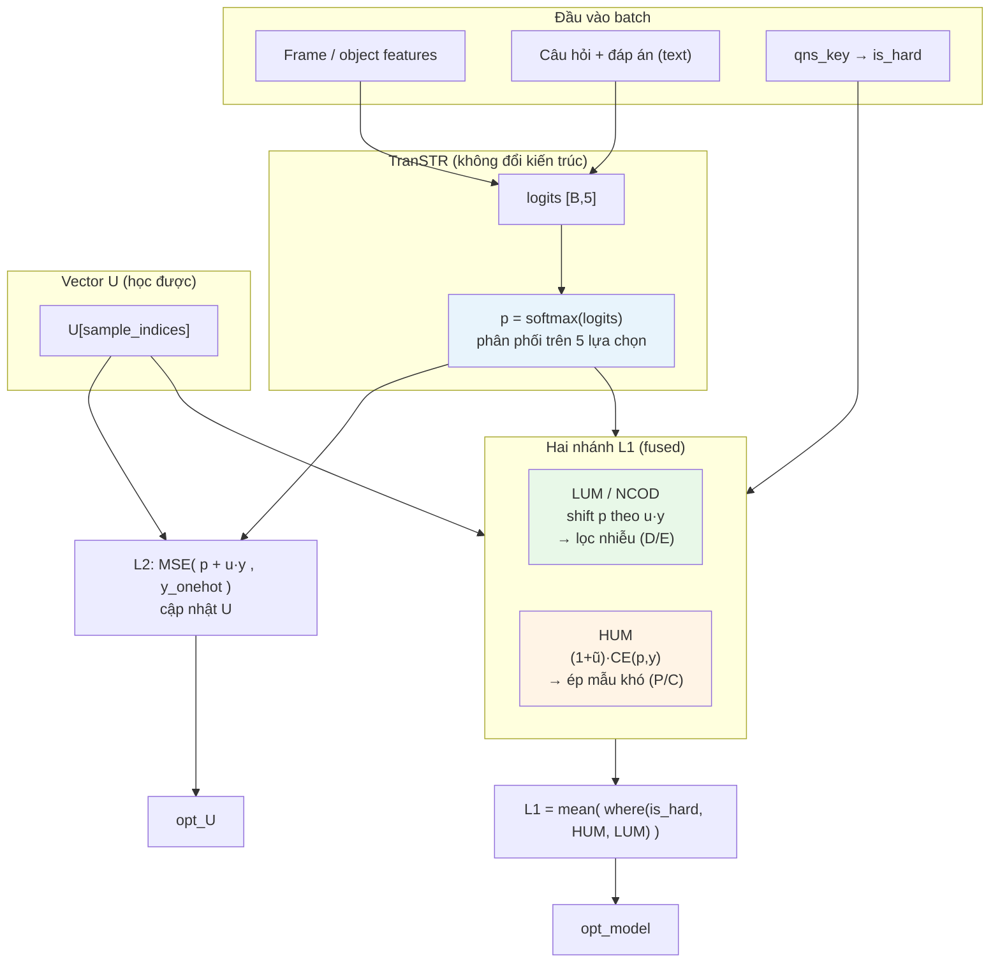
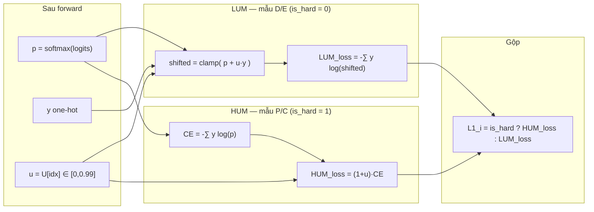
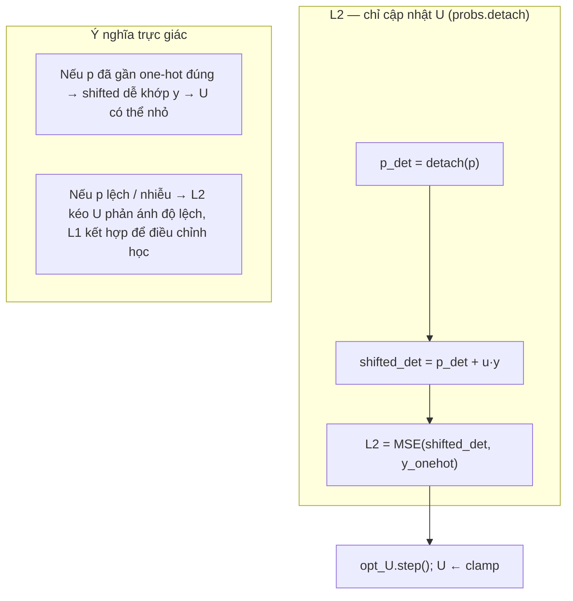

# Kiến trúc NCOD + HUM trong TranSTR — sơ đồ & ý tưởng

Tài liệu này bổ sung [`README_NCOD_PLANNING_HUM.md`](README_NCOD_PLANNING_HUM.md): nhìn **một mạch** từ **phân phối xác suất đầu ra** tới **hai cơ chế loss** (lọc nhiễu vs. ép học mẫu khó) và **cách `U` điều chỉnh trọng số**.

**Hình vẽ (SVG, mở trực tiếp trong VS Code / trình duyệt / chèn Word):**

| | File |
|---|------|
| Tổng thể | [`docs/figures/architecture_ncod_hum_overall.svg`](docs/figures/architecture_ncod_hum_overall.svg) |
| LUM vs HUM | [`docs/figures/architecture_ncod_hum_lum_vs_hum.svg`](docs/figures/architecture_ncod_hum_lum_vs_hum.svg) |
| L2 cập nhật U | [`docs/figures/architecture_ncod_hum_l2.svg`](docs/figures/architecture_ncod_hum_l2.svg) |

*PNG (matplotlib): nếu đã cài `matplotlib`, chạy `python docs/draw_architecture_ncod_hum.py` để xuất thêm PNG cùng thư mục `docs/figures/`.*

---

## 1. Ẩn dụ “đầu vào là phân phối xác suất”

Với **mỗi mẫu** trong batch:

| Khái niệm | Ý nghĩa |
|-----------|---------|
| **Phân phối dự đoán** | `p = softmax(logits)` ∈ ℝ⁵ — xác suất model gán cho 5 lựa chọn (đây là “phân phối nhận được” sau forward TranSTR). |
| **Nhãn thật (one-hot)** | `y` — vector one-hot của đáp án đúng. |
| **Hai *loại* mẫu** | Không phải hai phân phối *khác nhau đưa vào* model, mà **cùng một `p`** được xử lý **khác nhau** tuỳ mẫu thuộc **LUM** (Descriptive/Explanatory — coi là nhánh “nhiễu / dễ”) hay **HUM** (Predictive/Counterfactual ± Reason — “khó / bất định cao”). Phân loại lấy từ **`qns_key`** (metadata), không từ `p`. |
| **`U[sample]`** | Một số vô hướng học được (per-sample hoặc theo index), **điều chỉnh trọng số** trong loss: giảm ảnh hưởng nhiễu (LUM) hoặc tăng penalty (HUM), đồng thời L2 kéo “phân phối đã dịch” gần nhãn. |

Tóm lại: **đầu vào của khối NCOD+HUM** là cặp **(p, y, loại mẫu, U)** — trong đó `p` là phân phối xác suất chung cho mọi loại câu; **sự khác biệt khó/nhiễu** được mã hóa bằng **mask `is_hard`** + **nhánh loss**.

---

## 2. Sơ đồ tổng thể (end-to-end)

**Đọc nhanh:** Một **phân phối `p`** cho mọi mẫu; **U** can thiệp vào **cách tính loss**; **LUM** dịch khối xác suất đúng lớp để giảm học từ nhiễu; **HUM** nhân mạnh CE trên mẫu khó; **L2** huấn luyện `U` sao cho phân phối “đã dịch” khớp nhãn.

---

## 3. Chi tiết: cùng `p`, hai cơ chế (LUM vs HUM)

- **LUM (NCOD cổ điển trên nhánh dễ):** dịch xác suất tại lớp đúng `p + u·y` rồi lấy CE — mẫu có **u cao** (nhiễu/khó trong nhóm LUM) bị **giảm gradient** hữu ích qua cơ chế shift (đã trình bày trong notebook gốc).
- **HUM:** không shift theo kiểu đó; nhân **CE chuẩn** với **`(1 + u)`** — mẫu khó + bất định cao → **loss lớn hơn** → model phải học kỹ hơn trên nhánh causal.

---

## 4. Vòng lặp U: từ phân phối tới “lọc” và học `U`

L2 buộc **phân phối sau khi cộng `u` lên lớp đúng** gần **nhãn one-hot**, giúp **U** không phải hằng mà **phản ánh** mức cần chỉnh trên từng mẫu — đồng bộ với mục tiêu **dự đoán chính xác** và **giảm học từ nhiễu** ở nhánh LUM.

---

## 5. Bảng tóm tắt vai trò

| Thành phần | Vai trò trong kiến trúc |
|------------|-------------------------|
| **p (softmax)** | Phân phối xác suất chung; là “ngôn ngữ” chung cho cả LUM và HUM. |
| **`is_hard` (từ `qns_key`)** | Chọn **cơ chế loss**: lọc nhiễu kiểu NCOD **hay** penalty kiểu HUM. |
| **LUM / NCOD** | Trên D/E: shift `p` theo `u`·y — **giảm trọng số** học từ mẫu coi là nhiễu. |
| **HUM** | Trên P/C: **tăng trọng số** CE khi `u` lớn — **ép** model chú ý mẫu khó. |
| **L2 + `U`** | Học **u** sao cho phân phối đã chỉnh (`p + u·y`) khớp nhãn; **điều chỉnh** theo thời gian cùng L1. |

---

## 6. Ghi chú triển khai

- **Eval / inference:** thường **không** dùng `U` trong forward (chỉ softmax(logits) như baseline); phần NCOD+HUM là **cơ chế huấn luyện**.
- **Không có hai “đầu vào phân phối” tách biệt** cho hai loại mẫu: chỉ có **một `p`**; phân nhánh là do **metadata** + **hai công thức loss**.

---

## 7. Liên kết

- Kế hoạch code chi tiết: [`README_NCOD_PLANNING_HUM.md`](README_NCOD_PLANNING_HUM.md)
