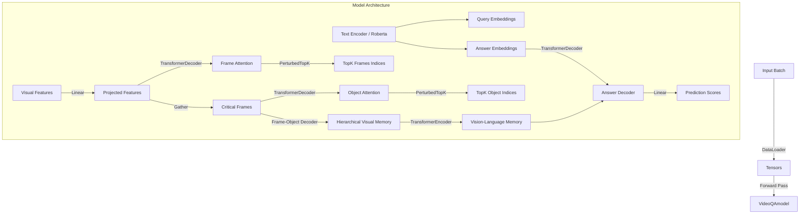

# Tài Liệu Kỹ Thuật Hệ Thống TranSTR_Casual

Tài liệu này mô tả chi tiết kiến trúc, luồng dữ liệu (Data Flow) và ánh xạ implementation (Code Mapping) của mô hình TranSTR cho bài toán Causal-VidQA.

## 1. Kiến Trúc Tổng Quan (Architecture Overview)



## 2. Chi Tiết Kỹ Thuật & Code Mapping

### 2.1. Feature Extraction & Input Pipeline (`DataLoader.py`)

- **Class**: `VideoQADataset`
- **Method**: `__getitem__`

**Quy trình xử lý dữ liệu đầu vào:**
1.  **Input Image/Video**:
    - `vid_frame_feat`: Load từ `.pt` files. Shape gốc: `[Total_Frames, 768]`.
    - `vid_obj_feat`: Load từ `.pkl` files.
2.  **Sampling (Cứng)**:
    - Code thực hiện uniform sampling để cố định kích thước temporal.
    - Biến: `indices = np.linspace(...)`.
    - Kết quả `vid_obj_feat`: `[topK_frame, obj_num, 2048+5]`.
3.  **Batch Construction**:
    - `collate_fn` của Pytorch tạo batch.
    - `qns_word`: List các câu hỏi strings.
    - `ans_word`: List các tuples (candidates), mỗi tuple có 5 chuỗi `[CLS] Q [SEP] A`.

---

### 2.2. Adaptive Selection Mechanism (`networks/model.py`)

Đây là cơ chế chọn lọc thông tin quan trọng (Critical Information) sử dụng **Differentiable TopK**.

#### A. Frame Selection (Lọc Thời Gian)
- **Module**: `self.frame_decoder` (TransformerDecoder) & `self.frame_sorter` (PerturbedTopK).
- **Code Logic**:
  1.  **Calculate Attention**:
      ```python
      # frame_feat: [B, F, d_model]
      # q_local: [B, L, d_model] (Question embedding)
      _, frame_att = self.frame_decoder(frame_feat, q_local, ...)
      # frame_att: Điểm attention thể hiện mức độ liên quan giữa Frame và Question.
      ```
  2.  **TopK Sorting**:
      ```python
      # Chọn ra indices của topK_frame quan trọng nhất
      idx_frame = self.frame_sorter(frame_att) 
      # idx_frame: Ma trận thưa (sparse matrix) hoặc one-hot xấp xỉ dùng để nhân.
      ```
  3.  **Gathering (Phép nhân ma trận)**:
      ```python
      frame_local = (frame_local.transpose(1,2) @ idx_frame).transpose(1,2)
      # Kết quả: Giảm chiều thời gian từ F -> frame_topK (ví dụ 20 -> 5).
      ```

#### B. Object Selection (Lọc Không Gian)
- **Module**: `self.obj_decoder` & `self.obj_sorter`.
- **Logic**: Tương tự Frame Selection, nhưng áp dụng lên chiều Objects của các Frame đã được chọn.
  ```python
  # obj_local: [B, frame_topK, O, d_model]
  _, obj_att = self.obj_decoder(obj_local.flatten(0,1), q_local_repeated, ...)
  idx_obj = self.obj_sorter(obj_att)
  # Kết quả: Giảm chiều vật thể từ O -> obj_topK.
  ```

---

### 2.3. Multi-grain Fusion (`networks/model.py`)

Sau khi lọc, mô hình có:
- **Critical Frames**: `frame_local` shape `[B, frame_topK, d_model]`.
- **Critical Objects**: `obj_local` shape `[B, frame_topK, obj_topK, d_model]`.

1.  **Frame-Object Fusion**:
    - **Module**: `self.fo_decoder`
    - **Mục đích**: Nhúng thông tin Objects vào Frame chứa nó.
    - **Code**: `frame_obj = self.fo_decoder(frame_local, obj_local.flatten(1,2))`
    - **Output**: `frame_obj` biểu diễn khung hình đã được cường hóa bởi các vật thể quan trọng bên trong.

2.  **Vision-Language Fusion**:
    - **Module**: `self.vl_encoder` (TransformerEncoder).
    - **Input**: Nối chuỗi `[frame_obj; q_local]` (Visual tokens + Question tokens).
    - **Self-Attention**: Cho phép các token hình ảnh và token từ ngữ tương tác toàn cục.
    - **Output**: `mem` (Memory) - đây là ngữ cảnh giàu thông tin nhất dùng để trả lời.

---

### 2.4. Answer Decoder & Final Prediction

Phần này giải quyết câu hỏi: *"Làm thế nào chọn ra câu trả lời đúng?"*.

- **Module**: `self.ans_decoder` (TransformerDecoder) & `self.classifier` (Linear).
- **Input**:
  - `tgt`: Embedding của token `[CLS]` từ câu trả lời ứng viên (`a_seq`). Shape: `[B, n_query, d_model]`.
  - `mem`: Visual Memory từ bước 2.3.

**Cơ chế hoạt động (Cross-Attention Scanning):**
1.  **Query-Key-Value Setup**:
    - Trong Decoder, `tgt` (Answer Candidate) đóng vai trò là **Query**.
    - `mem` (Vision) đóng vai trò là **Key** và **Value**.
2.  **Scanning**:
    - Mô hình thực hiện: `Attention(Q=Ans, K=Vis, V=Vis)`.
    - Nghĩa là: "Với câu trả lời ứng viên X này, hãy tìm xem trong Video Memory có bằng chứng nào ủng hộ (support) nó không?".
    - Nếu tìm thấy bằng chứng khớp, vector đầu ra sẽ mang tín hiệu mạnh.
3.  **Classification**:
    ```python
    out = self.ans_decoder(tgt, mem, ...)
    out = self.classifier(out).squeeze(-1) 
    # out shape: [Batch_Size, 5] (5 candidates)
    ```
    - `out` chứa 5 giá trị logit thực (scores).

4.  **Prediction**:
    - Trong lúc training: `CrossEntropyLoss` so sánh logits với ground truth index.
    - Trong lúc inference: `argmax(out)` chọn candidate có điểm cao nhất.

---

### 2.5. Xử lý Reasoning Types

Code xử lý câu hỏi `predictive` và `predictive_reason` hoàn toàn như nhau trong `forward pass`:
- Chỉ khác nhau ở **đầu vào văn bản** (`qns_word`).
- Ví dụ:
  - Video A + Question "What happens?" -> Model chọn "Man falls".
  - Video A + Question "Why?" -> Model chọn "Because floor is wet".
- Kết quả `PAR` (Predictive Action+Reason) chỉ được tính là đúng (`Acc = 1`) nếu **cả hai** lần forward pass trên đều ra index đúng. Logic này nằm trong file `eval_mc.py` hoặc cell đánh giá chi tiết trong Notebook.
